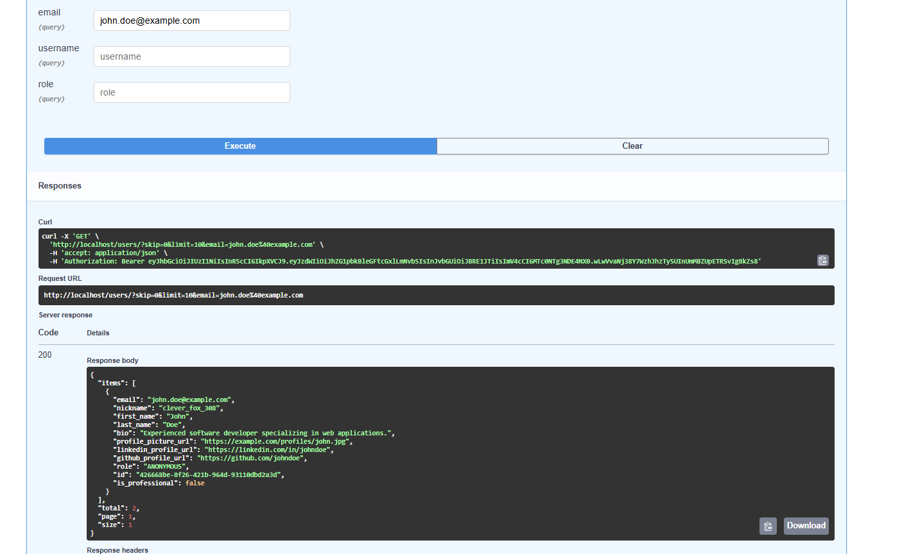
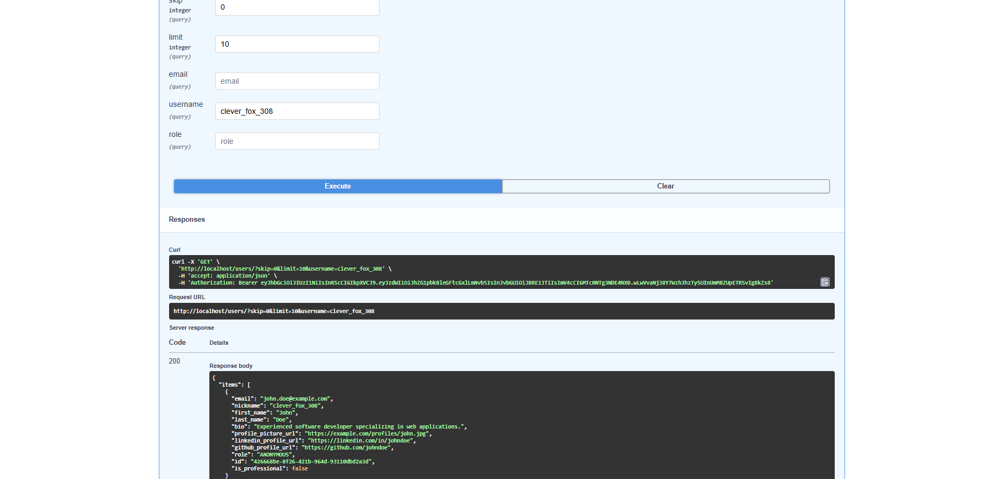
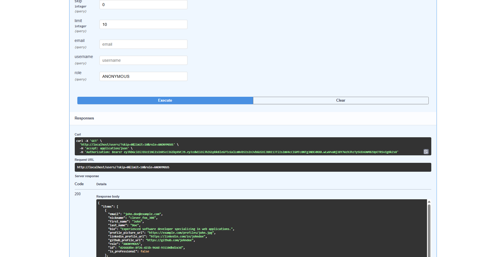
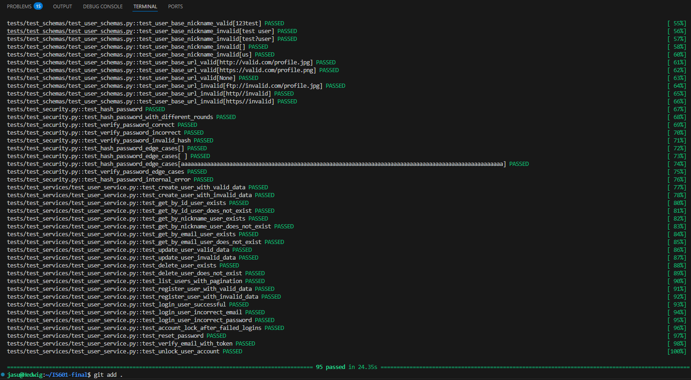

## User Search and Filtering Feature

### Description

This feature allows administrators to **search users** based on:

- **Email** (partial matches allowed)
- **Nickname** (partial matches allowed, mapped from username)
- **Role** (exact match: ADMIN, MANAGER, AUTHENTICATED, etc.)

Only users with **ADMIN** or **MANAGER** roles can perform the search operation.

It enhances the user management system by allowing easy user discovery based on multiple criteria.

---

## Screenshots

### Search by email

### Search by name

### Search by role

### Test Cases Pass

